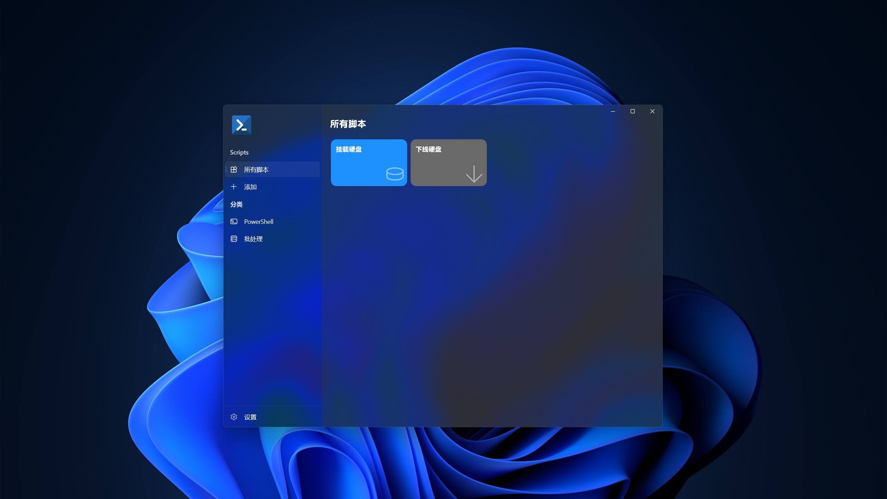

# 

    
    <h2 align="center">Conscript — 脚本文件启动中心</h4>

> 您是否是一位脚本文件的使用者？无论是批处理文件还是 PowerShell 脚本，不管多复杂的操作，只要轻轻双击，就可以等待脚本自动把所有工作都做好。一切都是那么的美好，只是，当脚本文件越来越多时，每次想要运行脚本，就要从众多图标一样的文件中，找到想要运行的脚本文件，这让人心烦，这不够优雅。如果您也有这种烦恼，那欢迎来体验一下 Conscript，它是脚本文件的启动中心，将所有的脚本文件藏在幕后，取而代之的，是丰富的图标，是多彩的卡片。

#### 点击下方按钮即可下载

#### 一睹芳容
